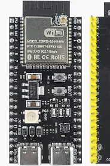

# ZenClaw

Lightweight AI agent framework for MicroPython. Runs on $3 ESP32-S3 hardware or the MicroPython unix port for desktop development.

<p align="center">
  
</p>

The entire agent framework — LLM calls, tool execution, vector memory, cron scheduling, Telegram bot — runs on this $3 microcontroller with 512KB SRAM.

## Features

- **Multi-provider LLM support**: Google Gemini (native API), any OpenAI-compatible provider (OpenAI, DeepSeek, Groq, local models via Ollama, etc.)
- **Tool-use agent loop**: Call LLM, execute tools, persist context, repeat
- **40+ built-in tools**: File I/O, code exec, vector memory, cron scheduling, web search, sub-agents, MCP client, image generation, Google Sheets, cloud storage (S3), Telegram messaging
- **Circuit breaker**: Detects stuck loops, no-progress polling, ping-pong patterns
- **Vector memory**: Keyword + embedding hybrid search with persistent markdown storage
- **Session management**: JSONL-persisted branching conversation trees
- **Sub-agents**: Spawn isolated background agent sessions with depth limits
- **Heartbeat**: Autonomous loop with cron scheduling and reflection turns
- **Multi-channel**: CLI and Telegram (voice, photos, typing indicator)
- **Cloud persistence**: Write-through S3-compatible sync — the device is brittle (flash wear, filesystem corruption, firmware reflashes), so sessions, memory, cron jobs, and user files are automatically backed up to cloud storage (Cloudflare R2 free tier, Backblaze B2, AWS S3) and restored on boot
- **Web UI**: Nuxt PWA — dashboard, config editor, file manager, ESP32 provisioning via Web Serial
- **ESP32-S3 ready**: WiFi via NVS, headless boot, hardware detection, SD card support

## Quick Start

### Desktop (MicroPython unix port)

```bash
# Copy config template and add your API key
cp firmware/config.example.json firmware/config.json
# Edit firmware/config.json with your provider API key, then:
cd firmware && micropython -X heapsize=4m run.py
```

### ESP32-S3

```bash
# Flash MicroPython
esptool --port /dev/ttyACM0 --chip esp32s3 erase_flash
esptool --port /dev/ttyACM0 --chip esp32s3 write_flash -z 0x0 firmware.bin

# Provision WiFi (once)
mpremote connect /dev/ttyACM0 exec "
from lib.wifi import set_credentials, connect
set_credentials('YOUR_SSID', 'YOUR_PASSWORD')
connect()
"

# Upload project files
mpremote connect /dev/ttyACM0 cp firmware/boot.py firmware/main.py firmware/config.json firmware/zenclaw_paths.py firmware/firmware-version.json :
mpremote connect /dev/ttyACM0 cp -r firmware/lib/ :lib/
mpremote connect /dev/ttyACM0 cp -r firmware/agent/ :agent/
mpremote connect /dev/ttyACM0 cp -r firmware/data/ :data/

# Reset — boots headless, listens on Telegram
mpremote connect /dev/ttyACM0 reset
```

### Testing

```bash
# Smoke test all tools (no LLM needed)
cd firmware && micropython -X heapsize=4m test_tools.py

# Send a single message through the full LLM pipeline
cd firmware && micropython -X heapsize=4m chat_test.py "What time is it?"

# Fresh session, quiet output
cd firmware && micropython -X heapsize=4m chat_test.py --reset --quiet "List my files"
```

## Architecture

```
firmware/boot.py (ESP32)                   WiFi from NVS -> connect
firmware/main.py (ESP32) / firmware/run.py (desktop)
  gateway.py                    — Core orchestrator, config, lifecycle
    prompt.py                   — System prompt from SOUL.md + tools + skills
    agent_loop.py               — LLM -> tool execution -> repeat
      runner.py                 — Provider dispatch, retry, streaming
      providers/                — Gemini native API + OpenAI-compatible format
      tools/                    — 40+ registered tools
      tool_loop.py              — Circuit breaker for stuck loops
    session_manager/            — JSONL branching conversation trees
    heartbeat_runner.py         — Autonomous background loop + cron
    telegram/                   — Polling, sending, media, typing indicator
    channels/                   — CLI and Telegram delivery
```

## Project Structure

```
zenclaw/
  firmware/                 ESP32 firmware (MicroPython agent)
    boot.py                 ESP32 boot (WiFi from NVS)
    main.py                 ESP32 entry (headless, Telegram)
    run.py                  Desktop entry (interactive REPL)
    provision_wifi.py       WiFi credential provisioning
    chat_test.py            Programmatic LLM test harness
    test_tools.py           Tool smoke tests
    config.example.json     Config template (copy to config.json with your keys)
    zenclaw_paths.py        Data directory path definitions

    agent/                  Main agent package
      gateway.py            Orchestrator + ZenClawGateway class
      agent_loop.py         Core LLM <-> tool loop
      runner.py             Provider dispatch + retry
      prompt.py             System prompt builder
      providers/            LLM API implementations
      tools/                40+ tool modules
      session_manager/      Conversation persistence
      telegram/             Bot polling, sending, media
      channels/             Channel abstraction (cli, telegram)
      cron/                 Scheduled task execution
      subagents/            Background agent spawning

    lib/                    MicroPython support libraries
      wifi.py               WiFi + NVS credential management
      httpclient.py         HTTP client (get, post, stream)
      sys/                  Logging, background tasks, board detection

    stubs/                  Desktop compatibility stubs
    data/                   Runtime data (sessions, memory, cron)

  web/                      Nuxt web UI (PWA dashboard, config, files, provisioning)
```

## Configuration

`firmware/config.json` (copy from `config.example.json`):

```json
{
  "providers": {
    "default": "google",
    "google": {
      "api_key": "...",
      "model": "gemini-2.5-flash",
      "base_url": "https://generativelanguage.googleapis.com/v1beta"
    }
  },
  "agent_name": "ZenClaw",
  "heartbeat": { "enabled": false },
  "channels": {
    "telegram": {
      "enabled": true,
      "bot_token": "...",
      "default_chat_id": "..."
    }
  }
}
```

Multiple providers can be configured. The `default` key selects which one to use. Provider `base_url` determines the wire format: Gemini URLs use Gemini native format, everything else uses OpenAI-compatible format (`POST /chat/completions` with Bearer auth). This means any OpenAI-compatible API (DeepSeek, Groq, Ollama, etc.) works out of the box.

## Cloud Persistence

The ESP32 is a $3 microcontroller with limited, wear-prone flash storage. Filesystem corruption from power loss, firmware reflashes, or flash wear is a real risk. ZenClaw mitigates this with automatic write-through replication to S3-compatible cloud storage.

**How it works:**

1. **Boot restore**: On startup, `pull_from_cloud()` downloads any local files missing from `data/` — sessions, memory, cron jobs, user files
2. **Background sync**: A worker uploads dirty files every 30 seconds. Local writes happen at full speed; replication is asynchronous
3. **Initial backup**: On first boot with sync configured, all existing local files are uploaded to the cloud bucket

**Supported providers**: Any S3-compatible service — Cloudflare R2 (10 GB free tier), Backblaze B2, AWS S3, MinIO, etc.

**What gets synced**: Sessions (`data/sessions/`), vector memory (`data/memory/`), cron jobs (`data/cron/`), and user files. Binary files (`.bin`, `.pyc`) and generated images are excluded. Files over 512 KB are skipped to conserve memory.

**Config** (add to `config.json`):

```json
{
  "storage": {
    "endpoint": "https://<account>.r2.cloudflarestorage.com",
    "access_key_id": "...",
    "secret_access_key": "...",
    "bucket": "zenclaw",
    "region": "auto"
  }
}
```

Agent system data is stored under a `sys/` prefix in the bucket (stripped transparently). User files uploaded via the file manager or `storage_write` tool go to the bucket root. The web UI provides a cloud file browser with presigned URLs for direct browser-to-bucket uploads and downloads.

## Design Comparison: ZenClaw vs pi-agent-core

ZenClaw's architecture compared to [pi-agent-core](https://github.com/badlogic/pi-mono/tree/main/packages/agent), a TypeScript agent framework by Mario Zechner. Different design goals lead to different trade-offs.

| Capability | ZenClaw | pi-agent-core |
|---|---|---|
| **Runtime** | MicroPython (ESP32 + desktop) | TypeScript (Node + browser) |
| **Philosophy** | Batteries-included, self-sufficient | Minimal kernel, hooks for everything |
| **Agent loop** | LLM -> tool exec -> repeat, with steering interrupts | Two-tier (inner tool loop + outer follow-up loop) |
| **Provider abstraction** | Single module, URL-based format detection | Registry with lazy-loaded provider modules |
| **Tool execution** | Sequential, single-phase | Parallel, three-phase (prepare/execute/finalize) |
| **Tool validation** | JSON Schema type + required + enum checks | AJV (full JSON Schema) with CSP-safe fallback |
| **Streaming** | Delta callbacks (`on_delta`, `on_reply`) | `EventStream<T,R>` push/pull async iterable |
| **Session persistence** | Built-in JSONL branching trees | None (consumer's responsibility) |
| **Context management** | Auto-compaction (LLM summarization) + pruning | Hook-based (`transformContext`) |
| **Retry logic** | Exponential backoff, 3 attempts, error classification | None (consumer's responsibility) |
| **Loop detection** | Circuit breaker (repeat, ping-pong, global no-progress) | None |
| **Memory** | Vector + keyword hybrid search, daily rotation | None |
| **Sub-agents** | Spawn with depth limits, timeouts, lifecycle events | None |
| **Cross-model switching** | Basic transcript repair | Full message transform (thinking blocks, tool ID normalization, orphan cleanup) |
| **Prompt construction** | Built-in from SOUL.md + tools + hardware introspection | None (passed through as string) |
| **Hardware awareness** | Chip, memory, buses, sensors in system prompt | N/A |

**Key takeaway:** pi-agent-core is a composable building block for apps that own their own persistence, retry, and prompt logic. ZenClaw is a standalone agent that needs to run autonomously on a microcontroller. The useful pattern borrowed from pi-agent: tool argument validation at the execution boundary, catching LLM mistakes before they reach tool code.

## Agent Identity

The agent's personality and instructions live in `firmware/data/SOUL.md`. Edit this file to customize how ZenClaw behaves.

## License

MIT
