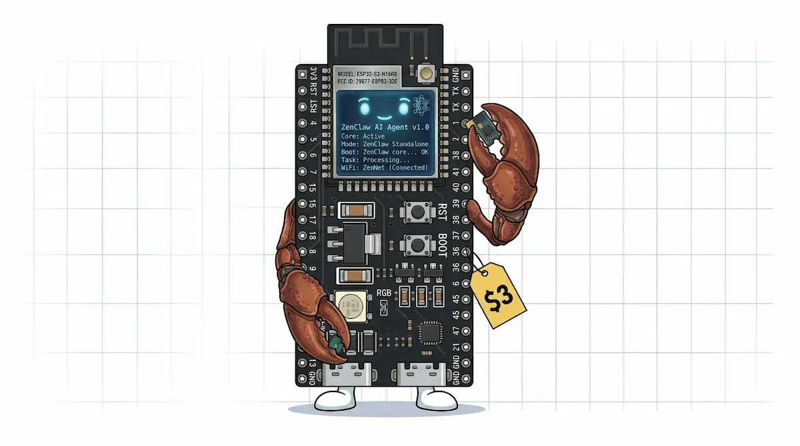

<p align="center">
  
</p>

# ZenClaw

> **Runs on 0.5 watts. Always on. Always yours.**

A fully autonomous AI agent that runs on a low-cost ESP32-S3 board (8 MB PSRAM) — tool use, persistent memory, multi-channel messaging, all on-device. Cloud-backed persistence (S3-compatible) protects your data from flash wear and reflashes via transparent write-through replication. Works with any LLM provider: Gemini, OpenAI, DeepSeek, Groq, local models via Ollama, or anything OpenAI-compatible. Written in Rust on `esp-idf-svc`, deployable straight from the browser via Web Serial. Supports ESP32-S3 (WiFi) and ESP32-P4 (Ethernet).

## Features

- **Multi-provider LLM support**: any OpenAI-compatible provider (OpenAI, Google Gemini via its OpenAI-compat endpoint, DeepSeek, Groq, zAI, Anthropic, local models via Ollama, etc.) — all spoken over `POST /chat/completions` with `Bearer` auth
- **Tool-use agent loop**: Call LLM, execute tools, persist context, repeat
- **Consolidated tool system**: 7 action-param tools on device (file I/O, memory, sessions, gateway, cron, web fetch/search, cloud storage). Each tool dispatches multiple actions, so the LLM sees many more operations than schemas. Sub-agents exist in the codebase but are not yet wired on ESP32; an MCP client is on the [Roadmap](#roadmap).
- **Circuit breaker**: Detects stuck loops, no-progress polling, ping-pong patterns
- **Persistent memory**: Markdown-backed memory store with keyword search (vector embeddings deferred — see [`CLAUDE.md`](CLAUDE.md))
- **Session management**: JSONL-persisted branching conversation trees
- **Sub-agents** *(desktop today; ESP32 on the [Roadmap](#roadmap))*: Spawn isolated background agent sessions with depth limits
- **Heartbeat & cron** *(planned — see [Roadmap](#roadmap))*: Autonomous reflection loop and scheduled tasks; config and scheduler scaffolding exist, execution is not yet wired
- **Multi-channel**: Web UI, Telegram (text + typing indicator), HTTP API
- **Cloud persistence**: Write-through S3-compatible sync — sessions, memory, cron jobs, and user files automatically backed up to cloud storage (Cloudflare R2 free tier, Backblaze B2, AWS S3) and restored on boot
- **Three-tier storage**: 8 MB on-device LittleFS for sessions/memory/configs, microSD card via FATFS for datasets and large blobs (Guition P4 today; gated by board), and S3-compatible cloud — all surfaced through one file manager UI
- **Web UI**: Nuxt PWA — dashboard, config editor, file manager, browser-based device provisioning via Web Serial
- **Multi-board**: ESP32-S3 (DevKitC) and ESP32-P4 (Guition + microSD); WiFi or Ethernet; multiple devices coexist on one network via mDNS

## Quick Start

Open [bennyzen.github.io/zenclaw](https://bennyzen.github.io/zenclaw/) in Chrome or Edge (Web Serial required). Plug your ESP32 board in via USB and go to the Provision page. The wizard handles everything:

1. **Configure** — Pick a board (DevKitC or Guition P4), enter a device name (or roll one), supply WiFi credentials (skipped for Ethernet boards), pick an LLM provider, paste your API key
2. **Flash** — The browser flashes the firmware image and an NVS partition (device hostname + WiFi creds) in one shot via Web Serial. No CLI tools, no manual file copying
3. **Connect** — The device boots, joins the network (WiFi for S3, Ethernet for P4), and appears at `<devicename>.local`. The wizard pushes the LLM provider config automatically

> **Privacy**: Everything you type in the wizard stays between your browser and your ESP32. The wizard is a static page on GitHub Pages — no analytics, no telemetry, no third-party servers. WiFi credentials are flashed directly over the USB cable into the device's NVS partition; the API key is POSTed only to the device on your local network. The single outbound request the wizard makes is to `openrouter.ai/api/v1/models` to populate the model-name dropdown, and it carries no user data. Safe to paste your real API key.

Done. The device is running at `http://<devicename>.local`. The dashboard connects to it from the same hosted web UI — your browser bridges to the device on your local network.

For developers building from source, see [`CONTRIBUTING.md`](CONTRIBUTING.md) for toolchain setup and the build/flash workflow, and [`CLAUDE.md`](CLAUDE.md) for board manifests and Rust architecture.

## Run locally (desktop)

No hardware required for development. The agent has a native desktop build that
runs the same agent core, tools, sessions, and HTTP API as the firmware,
talking to LLM providers via the `genai` crate:

```bash
cd agent
cargo +stable run --no-default-features --features desktop
```

(`agent/` pins the Espressif `esp` toolchain for firmware builds, so `+stable`
runs the desktop build on your default stable Rust — no `espup` needed.)

It reads `config.json` from the working directory (`agent/config.json`,
gitignored) — create one with at least `agent_name`, `providers.default`, and a
provider entry with `api_key` + `model` (see [Configuration](#configuration)).
The API listens on `0.0.0.0:8080` (override with `ZENCLAW_PORT`), so the web UI
connects to it exactly like a physical device. See [`CONTRIBUTING.md`](CONTRIBUTING.md)
for tests and the full toolchain.

## Architecture

```
agent/src/
  main.rs                 ESP32 entry: NIC bring-up, mDNS, LittleFS, SD card (P4), HTTP server, Telegram poller
  sdcard.rs               microSD via FATFS (gated by `sdcard` cargo feature)
  core/                   Shared agent logic
    gateway.rs            Core orchestrator, chat() entry point
    agent_loop.rs         LLM <-> tool execution loop
    runner.rs             Provider dispatch trait
    compaction.rs         Session compaction
    tools/                Tool implementations (action-param pattern)
      memory_tools.rs     Persistent memory store (markdown-backed, keyword search)
    sessions/             JSONL conversation persistence
    channels/
      telegram.rs         Telegram bot (long-poll + send)
    cron.rs               Scheduled tasks
    cloud/                S3-compatible client + SigV4 signer
  net/                    NIC abstraction (WiFi for S3, Ethernet for P4)
  esp32/                  ESP32 HTTP runner (esp-idf-svc)
  desktop/                Desktop HTTP server + client (axum + reqwest)
agent/components/
  zenclaw_sd/             Local IDF component wrapping SDMMC + FATFS for the SD driver
```

See [`CLAUDE.md`](CLAUDE.md) for the full architecture, board profiles, and build workflow.

## Project Structure

```
zenclaw/
  agent/                    Rust agent (ESP32-S3 + ESP32-P4 + desktop targets)
    boards/                 Per-board TOML manifests (devkitc, guition-p4)
    bootloaders/            Vendored ESP-IDF bootloaders
    src/                    Rust source (see CLAUDE.md)
    justfile                Multi-board build commands
  agent-smoke/              Minimal reference crate for porting to new chips
  web/                      Nuxt web UI (PWA dashboard, config editor, file manager, provisioning)
  scripts/                  Build helpers (build-rust-firmware.sh)
  docs/                     Specs, plans, design documents
```

## Configuration

Configuration is handled through the web UI — the Config page edits the device's stored config directly over your local network. The provisioning wizard sets up the initial provider and API key. Example shape:

```json
{
  "providers": {
    "default": "google",
    "google": {
      "api_key": "...",
      "model": "gemini-2.5-flash",
      "base_url": "https://generativelanguage.googleapis.com/v1beta/openai"
    }
  },
  "agent_name": "ZenClaw",
  "heartbeat": { "enabled": false },
  "channels": {
    "telegram": {
      "enabled": true,
      "bot_token": "...",
      "default_chat_id": "..."
    }
  }
}
```

Multiple providers can be configured. The `default` key selects which one to use. **All providers speak OpenAI-compatible** (`POST /chat/completions` with `Bearer <key>` auth) — Gemini included, via its own OpenAI-compat endpoint at `…/v1beta/openai`. Any OpenAI-compatible API (OpenAI, DeepSeek, Groq, zAI, Anthropic, Ollama, etc.) works out of the box. The runner auto-appends `/openai` to legacy `…/v1beta` Gemini URLs so existing devices migrate without manual edits.

## Cloud Persistence

The ESP32 has limited, wear-prone flash storage. Filesystem corruption from power loss, firmware reflashes, or flash wear is a real risk. ZenClaw mitigates this with automatic write-through replication to S3-compatible cloud storage.

**How it works:**

1. **Boot restore**: On startup, missing local files are downloaded from the bucket — sessions, memory, cron jobs, user files
2. **Background sync**: Dirty files replicate to the bucket asynchronously. Local writes happen at full speed
3. **Initial backup**: On first boot with sync configured, all existing local files are uploaded

**Supported providers**: any S3-compatible service — Cloudflare R2 (10 GB free tier), Backblaze B2, AWS S3, MinIO, etc.

**What gets synced**: sessions, memory, cron jobs, and user files. Generated binaries and images are excluded.

Configure storage via the web UI's Config page or POST to `/api/config`:

```json
{
  "storage": {
    "endpoint": "https://<account>.r2.cloudflarestorage.com",
    "access_key_id": "...",
    "secret_access_key": "...",
    "bucket": "zenclaw",
    "region": "auto"
  }
}
```

Agent system data is stored under a `sys/` prefix in the bucket (stripped transparently). User files uploaded via the file manager go to the bucket root. The web UI provides a cloud file browser with presigned URLs for direct browser-to-bucket uploads and downloads.

## Agent Identity

The agent's personality and instructions live in `SOUL.md` on the device's filesystem. Edit it via the web UI's File Manager to customize how ZenClaw behaves.

## Security & Trust Model

ZenClaw is a **local-network appliance**. The on-device HTTP/WebSocket API is
**unauthenticated by design** in the current release: any host on the same
network (and, because responses send `Access-Control-Allow-Origin: *`, any
website you visit in a browser on that network) can read your stored secrets in
cleartext via `GET /api/config` (LLM API keys, Telegram bot token, S3/R2
`secret_access_key`), read/write the device filesystem, reboot the device, and
mint presigned URLs for your cloud bucket.

**Only run ZenClaw on a trusted network you control. Never port-forward it or
place it on an untrusted/guest network.** Optional authentication and secret
redaction are planned. See [`SECURITY.md`](SECURITY.md) for the full trust model
and how to report vulnerabilities.

## Roadmap

The following features are described in this README as part of the agent's design but are **not yet shipping in the on-device build**. They were either dropped during the no-PSRAM era and are being re-added now that the DevKitC (8MB PSRAM) is the floor, or are partially built and waiting on integration. Each item lists what exists today and what "shipped" means, so progress is measurable.

### 1. Sub-agents on ESP32

- **Today**: `subagent_tools.rs` and `subagents.rs` exist and run on desktop. ESP32 explicitly omits them (`agent/src/core/tools/mod.rs`: *"message_send and subagent omitted — not viable on ESP32 hardware"*). Constraint inherited from the no-PSRAM era.
- **Shipped when**: `register_defaults` registers `SubagentTool` on ESP32, the spawn path uses PSRAM heap explicitly, depth limits are enforced (default 2), and a memory-pressure smoke test on DevKitC survives 5 nested spawns without OOM.
- **Estimated effort**: small-to-medium. The desktop implementation is a working reference; the surgery is mostly removing the gate + verifying memory headroom.

### 2. Heartbeat loop

- **Today**: `HeartbeatConfig` is parsed from config (`agent/src/config.rs`) on both targets. A scheduler skeleton in `agent/src/desktop/background/mod.rs` ticks a timer and emits `Heartbeat tick (stub)` log lines on desktop, but neither target actually runs a reflection turn — the desktop loop has a `// TODO: run heartbeat prompt through gateway` placeholder, and ESP32 has no spawned thread at all.
- **Shipped when**: a thread runs every `heartbeat.every_secs` (default 300) when `enabled: true`, executes a reflection turn against the configured provider, and persists the result to a session named `heartbeat`. Off by default; verifiable via `/api/status` showing last-tick timestamp on both desktop and DevKitC.
- **Estimated effort**: small. The scheduler tick is wired on desktop; the gap is the gateway call + session persistence, plus spawning the equivalent thread from `main.rs` on ESP32.

### 3. Cron job execution

- **Today**: `CronStore` and `CronService` parse and surface due jobs (`agent/src/core/cron.rs`); the desktop background runner detects them on every 60-second tick and emits `CRON: job due (execution via gateway not yet wired)` log lines, but no job has ever actually run. ESP32 has no cron tick at all.
- **Shipped when**: due jobs dispatch through the gateway with the configured provider, results persist to a per-job session, and the next-run timestamp updates atomically. Surfaces in `/api/status` with last-execution time per job.
- **Estimated effort**: small. The detection and storage layers exist; the gap is the `// TODO: dispatch job through gateway for actual execution` line in `desktop/background/mod.rs:38` plus an ESP32 thread to drive the same path.

### 4. Telegram voice messages

- **Today**: typing indicator (`sendChatAction`) and text are shipping in `agent/src/core/channels/telegram.rs`. Inbound photos/vision are not yet wired (photo-only messages are currently dropped).
- **Shipped when**: inbound voice messages are downloaded via `getFile`, transcribed (likely via the configured provider's STT endpoint or a dedicated provider), and dispatched to the agent loop as text. Outbound `sendVoice` for assistant replies is a stretch goal — text replies to voice messages are the v1 deliverable.
- **Estimated effort**: medium. The transcription dependency is the open design question (which provider, what wire format) — `genai`'s STT support is the natural starting point.

### 5. MCP client

- **Today**: nothing on device. (An earlier announce-stub `mcp_tools.rs` was deleted as actively misleading — it told the LLM the tool existed but did nothing on call.) MCP is the universal tool protocol that Anthropic, OpenAI, Cursor, and VS Code all speak; an ESP32 that can connect to remote MCP servers inherits a large tool ecosystem (web search, GitHub, filesystem servers, etc.) without needing each integration coded by hand.
- **Shipped when**: an `mcp` tool exposes `connect`, `list_tools`, `call`, `disconnect`, and `servers` actions; supports HTTP+SSE and Streamable HTTP transports (stdio is impossible on device); manages multiple concurrent server sessions; handles per-server auth headers; and survives a smoke test connecting to one Anthropic-hosted MCP server and one local-network MCP server with at least one round-trip tool call each.
- **Estimated effort**: medium-to-large. Real surface area: JSON-RPC 2.0 client + transport layer + session lifecycle + per-server auth + result-size budgeting (MCP responses can be huge). Worth doing — the leverage is high — but not a wire-up.

If you depend on any of these for your use case, please open an issue so we can prioritize.

## License

MIT — see [LICENSE](LICENSE).
